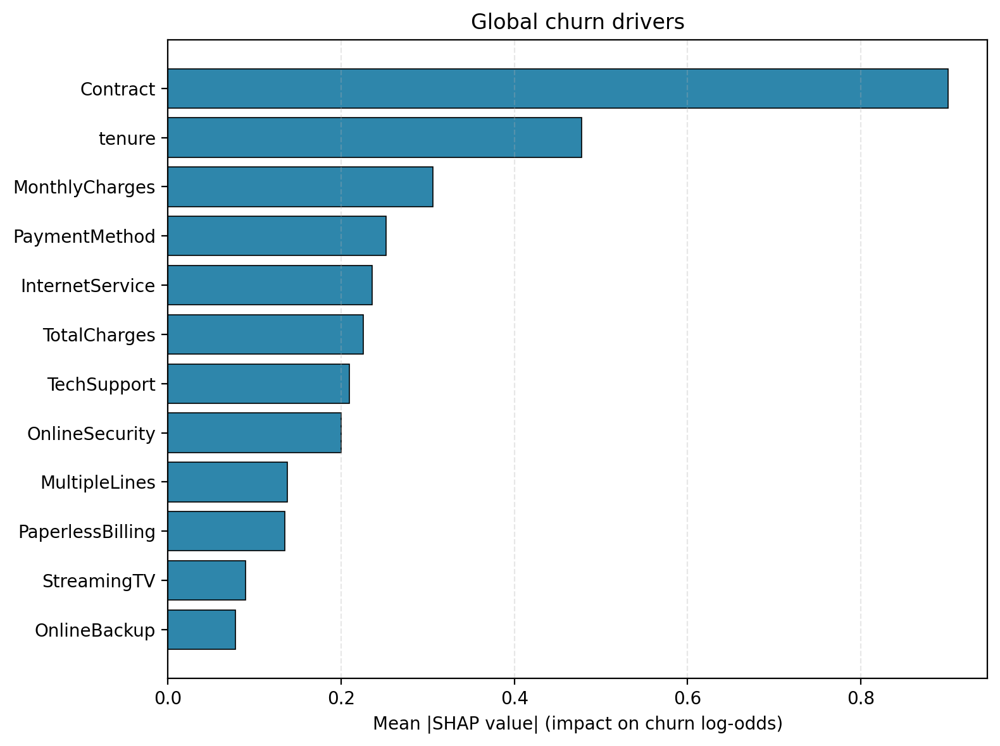
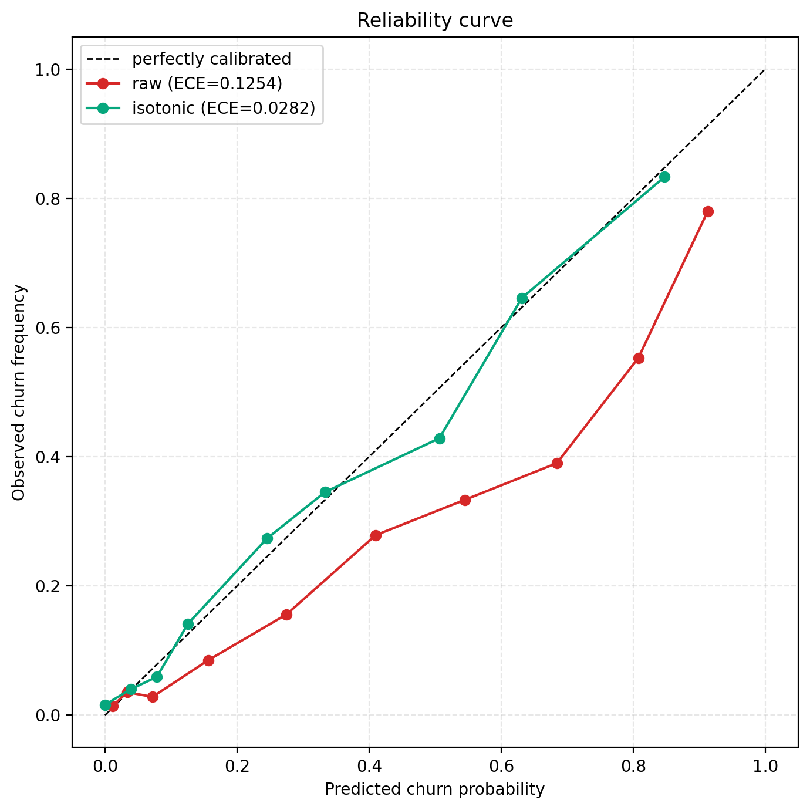
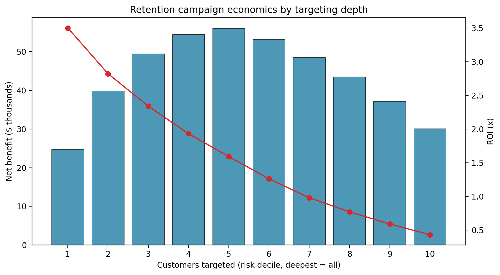

# Customer Churn: from EDA to a deployable risk model

Predicting which telco customers are about to leave, *and* turning that into a
dollar-ranked call list a retention team can actually work. The project goes the
whole way: SQL data access -> hypothesis testing -> a calibrated gradient-boosting
model -> SHAP explanations -> an ROI / A/B-test layer -> a Streamlit app.

**Live app:** _add your Streamlit Cloud URL here after deploying (see [Deploy](#deploy))_


<!-- add docs/images/app_screenshot.png after the first run: streamlit run app.py, then screenshot -->

Dataset: [Telco Customer Churn](https://www.kaggle.com/datasets/blastchar/telco-customer-churn) - 7,043 customers, 21 fields, 26.5% churn.

---

## TL;DR results

| | |
|---|---|
| Model | XGBoost, **ROC-AUC 0.843**, **PR-AUC 0.665** (base rate 0.265) |
| Calibration | isotonic, **ECE 0.125 -> 0.028**, Brier 0.161 -> 0.138 |
| Strongest driver | Contract type (Cramér's V = 0.41), then tenure (Cohen's d = -0.85) |
| Revenue at risk | ~ **$1.66M/yr** in expected lost revenue across the book |
| Best campaign | target top 5 risk deciles -> **$56k net benefit**, top decile alone returns **3.5x ROI** |
| A/B test | simulated retention offer cuts churn **80% -> 55%** in the top decile (p = 0.001) |

I lead with PR-AUC, not ROC-AUC: churn is imbalanced, and the retention team only
cares about the positive class. ROC-AUC flatters imbalanced problems.

---

## Why this isn't just another churn notebook

Most churn repos stop at "month-to-month customers churn more, here's a bar chart."
The parts that actually matter in a data-science role are downstream of that:

1. **The differences are tested, not eyeballed.** Every driver gets a p-value *and*
   an effect size (`src/stats_tests.py`). With 7k rows everything is "significant",
   so I rank on effect size - that's the number that decides where to spend effort.
2. **The probabilities are calibrated.** A score of 0.8 means ~80% of those
   customers really churn, which is the only reason the dollar math below is
   trustworthy (`src/calibrate.py`).
3. **It's costed.** Risk scores become a ranked call list with cost, revenue
   retained and ROI per targeting depth (`src/business_impact.py`).
4. **The uplift is measured, not assumed.** A simulated control-vs-treatment A/B
   test estimates how much a retention offer actually moves churn, with a
   significance test on the lift.

## Statistical findings

`python -m src.stats_tests`

| Driver | Test | p-value | Effect size | Magnitude |
|---|---|---|---|---|
| tenure | Welch t-test | ~1e-232 | Cohen's d = -0.85 | large |
| Contract | chi-square | ~1e-258 | Cramér's V = 0.41 | medium |
| InternetService | chi-square | ~1e-160 | Cramér's V = 0.32 | medium |
| PaymentMethod | chi-square | ~1e-140 | Cramér's V = 0.30 | medium |
| MonthlyCharges | Welch t-test | ~1e-73 | Cohen's d = 0.45 | small |

Takeaway: **contract length and tenure dominate.** Higher monthly charges matter
too, but the effect is small once you account for everything else - useful to know
before throwing discounts at the problem.

## Model & explainability

XGBoost on a stratified 80/20 split, class imbalance handled with
`scale_pos_weight`, decision threshold tuned for F1 instead of the naive 0.5.

SHAP (TreeSHAP, computed via XGBoost's native `pred_contribs` so it's robust to
library version drift) agrees with the stats: Contract, tenure and MonthlyCharges
lead globally, and every prediction in the app comes with a per-customer breakdown.




## Business impact

Assumptions (all in one place, `CampaignAssumptions`): **$50** per contact,
**30%** save rate, **12-month** revenue horizon. These are estimates - change them
and the table moves.



`python -m src.business_impact` prints the full decile table and the A/B test. The
sweet spot is targeting the top half by risk (~$56k net benefit); if budget is
tight, the top decile alone returns 3.5x and saves the highest-value accounts.

## SQL

The loader doesn't read the CSV directly. It builds a local SQLite warehouse from
it once, then pulls everything back with a query (`src/data_loader.py`,
`DEFAULT_CHURN_QUERY`) - mirroring how the data would actually live in a warehouse,
and giving a clean place to add filters/joins later. Swap in your own SQL and the
rest of the pipeline doesn't change.

```python
from src.data_loader import load_from_sqlite
df = load_from_sqlite()  # CSV -> SQLite -> SQL query -> DataFrame
```

## Project layout

```
src/
  config.py          paths, seeds, plot + model config
  data_loader.py     SQLite warehouse + SQL loader, quality checks
  stats_tests.py     chi-square / t-tests + Cramér's V / Cohen's d
  model.py           XGBoost pipeline, train/eval, ROC-AUC + PR-AUC
  calibrate.py       isotonic/Platt calibration, ECE, reliability curve
  business_impact.py decile ROI analysis + simulated A/B test
  explain.py         global + per-customer SHAP
  visualizations.py  EDA plots
notebooks/01_telco_churn_eda.ipynb   EDA + significance section
app.py               Streamlit dashboard
make_report_assets.py  regenerates the README figures
run_eda.py           scripted EDA
```

## Run it

```bash
pip install -r requirements.txt
./download_dataset.sh           # or drop the CSV in data/ manually

python -m src.model             # train + held-out metrics
python -m src.stats_tests       # significance tests
python -m src.calibrate         # calibration report + reliability curve
python -m src.business_impact   # ROI table + A/B test
python -m src.explain           # SHAP drivers
python make_report_assets.py    # rebuild README figures

streamlit run app.py            # the dashboard
```

## Deploy

The app runs on [Streamlit Community Cloud](https://share.streamlit.io) for free:

1. Push this repo to GitHub. The Telco CSV is committed under `data/`, and the app
   builds the SQLite db from it on startup, so there's nothing else to wire up.
2. On Streamlit Cloud: **New app** -> point it at this repo -> main file `app.py`.
3. Paste the resulting URL at the top of this README.

## Notes / honest limitations

- The A/B test is a **simulation** - it draws outcomes from the calibrated
  probabilities to estimate uplift. Real numbers need a real campaign. It's here to
  show the experimentation workflow, not to claim a measured lift.
- ROI depends entirely on the cost/uplift assumptions; treat the dollar figures as
  illustrative until validated against actuals.
- Single train/test split with a fixed seed. For production I'd add cross-validated
  metrics with confidence intervals and monitor for drift.
